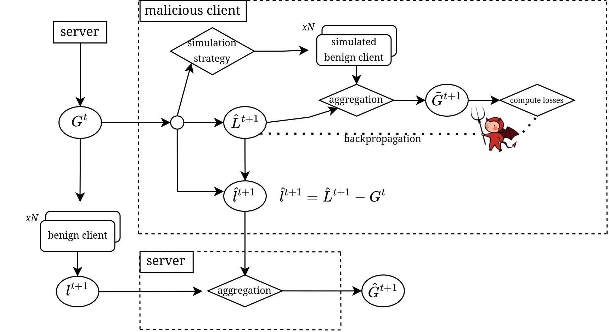

# [BadAvg](link-to-paper)


This repository contains the code of [BadAvg](link-to-paper), an aggregation-aware backdoor attack on Federated Contrastive Learning (FCL) built on [BadEncoder](https://github.com/jinyuan-jia/BadEncoder) that integrates the federated averaging process into the attack optimization to achieve high effectiveness, stealth, and efficiency while evading state-of-the-art defenses. Here is an overview of BadAvg: 


<div align="center">

</div>

## Citation

If you use this code, please cite the following [paper](link-to-paper):
```
paper
```


## Required python packages

Our code is tested under the following environment: Ubuntu 24.04.2 LTS, Python 3.13.7.

To set up the Python environment, first create and activate a virtual environment (e.g., with ```python -m venv .venv``` and ```source .venv/bin/activate ```). Then install all required dependencies by running:

``` 
pip install -r requirements.txt
``` 

## Running a Federated Experiment

> **_NOTE:_**  Default backbone network is _resnet18_. We experimented both with resnet18 and resnet50. If you want to change the backbone network, you need to do it manually by changing lines 8 and 35 of _models/simclr_model.py_ (possible choices: _resnet18, resnet34, resnet50_)

The script `run_federated.py` launches a federated experiment: it pre-trains an image encoder on the chosen dataset partitions, (optionally) applies the BadAvg attack and finally evaluates the model on a specified downstream dataset, keeping track of classification accuracy and attack success rate.

Control the experiment by editing the indicated knobs in the script (line 22). Example:

```
NUM_ROUNDS = 5 # Total number of federated rounds
BAD_ROUNDS = -1 # Run poison attack every BAD_ROUNDS rounds (-1 to disable)
OUTPUT_DIR = "./output/federated_exp_test" # Output directory for logs, models, plots
PRETRAIN_DATASET = "cifar10" # Dataset for pre-training (either "cifar10" or "stl10")
SHADOW_DATASET = "cifar10" # Shadow dataset for attack (either "cifar10" or "stl10")
DOWNSTREAM_DATASET = "stl10" # Dataset for evaluation 
DATASET_DISTRIBUTION = "iid"  # Dataset distribution among clients ("iid" or "dirichlet" for non-iid)
ATTACK = 0 # 0 for no attack (clean federated experiment), 1 for Naive, 2 for BadAvg, 3 for BAGEL
DEFENSE = 0 # 0 for no defense, 1 for clip&noise (if attack is 0, this is ignored)
[...]
```

> **_NOTE:_**  Knobs at lines 24-28 to specify the base paths. If you don't change the folder structure, it should work even if you change the machine.
  
You can further customize the experiment by editing other knobs (number of clients per round, local training epochs, attack epochs, aggregation learning rate, etc.) or changing parts of the main script and its callees.

Before running an experiment, you have to first download the pre-partitioned data from the following link [data](https://mega.nz/file/lBMSCaob#sZhTATLgCbO90M7awq1yq8WIBoxjBGvIt0C9vap6sv0) (put the data folder in the main directory). Then, you could run the experiment with the above mentioned standard parameters by simply running: 

```
python3 scripts/run_federated.py
```

## Running Individual Components

The framework is designed to be **modular**. While `run_federated.py` is the main script for orchestrating a complete federated learning experiment, each core component (pre-training, attack simulation, and evaluation) is a standalone script.

This allows you to execute specific tasks independently. For example, you can:
* Run only the **evaluation** on a pre-existing model with `run_[...]_training_downstream_classifier.py`
* Perform only the model **aggregation** step with `aggregation_experiments.py`
* Execute a non-federated **pre-training** run to generate an encoder (based on legacy code from the original BadEncoder implementation) with `run_pretraining_encoder.py`.

## Experimental results
...


We refer to the following code in our implementation:
https://github.com/jinyuan-jia/BadEncoder


